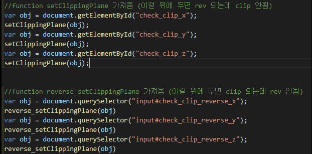
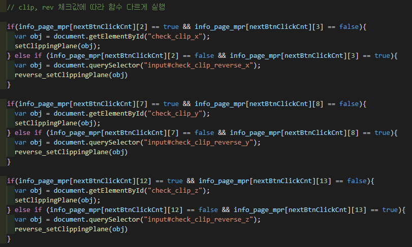

## 📆 2021-08-25(수) TIL


### ⚠️ 오늘의 문제 
___ct plane을 원하는 위치대로 놔야 하는데 
그러려면 three.js 매트릭스를 알아야 한다..___   <br><br>
 -> 기존 코드를 수정해서 이 문제를 해결할 수 있었다!
<hr>


### 🔥 08.24 어제 해낸 것
ct plane을 ui 저장된 값에 따라 위치 셋팅을 완료했다.<br>
clipping기능 완료

### 🔥 오늘 해낸 것  <br>
*여러 방법을 시도하여 reverse기능을 완료했다<br>
* for문을 이용해 페이지별 카메라 셋팅값 저장을 구현했다
```javascript
var strCameraInfo = "var camera_pos = "
    strCameraInfo += "[";
    for (var page_num = 0; page_num < scenarioText.length; page_num++ )
    {
      strCameraInfo += "[";
      strCameraInfo += String(camera_pos[page_num]) 
      strCameraInfo += "],";
    }
    strCameraInfo += "];";
  
    strCameraInfo += "var camera_rot = [";
    for (var page_num = 0; page_num < scenarioText.length; page_num++ )
    {
      strCameraInfo += "[";
      strCameraInfo += String(camera_rot[page_num]) 
      strCameraInfo += "],";
    }
    strCameraInfo += "];";

    strCameraInfo += "var camera_up = [";
    for (var page_num = 0; page_num < scenarioText.length; page_num++ )
    {
      strCameraInfo += "[";
      strCameraInfo += String(camera_up[page_num]) 
      strCameraInfo += "],";
    }
    strCameraInfo += "];";

    strCameraInfo += "var camera_rot_quat = [";
    for (var page_num = 0; page_num < scenarioText.length; page_num++ )
    {
      strCameraInfo += "[";
      strCameraInfo += String(camera_rot_quat[page_num]) 
      strCameraInfo += "],";
    }
    strCameraInfo += "];";


```


#### 🤷 시도해본 방법 
1. 왜 같은 함수를 쓰는데 안될까? 호출 환경이 달라서 그런걸까? 의아해서 <br>
dom속성을 샅샅히 watch로 살펴 봤다.<br>

페이지가 로딩될때 실행되는 이벤트리스너 종류가 prograssEvent,<br>
클릭했을때 실행되는 이벤트리스너 종류가 PointEvent인 차이 때문에 그런가? 하며<br>
값을 이것 저것 대입했으나 되지 않음<br>

2. 함수 순서를 바꾸어 보았다.<br>
그러나 아래의 주석과 같은 오류가 났다 . <br>


3. **성공한 방법**<br> 
2번의 경우처럼 저 6개의 함수를 다 실행할 필요가 없었다  
**if문으로 오브젝트 구현에 필요한 함수만 실행했다**



<hr>

#### DOM 조작

```javascript
document.getElementById("아이디명" )
document.querySelector("input#아이디명")
```


크롬 개발자도구 watch에서 dom객체의 속성을 볼수 있는데,  
임의로 
```javascript
obj.target = "원하는 타겟 입력" 
obj.value = "원하는 값 입력" 처럼  
```
속성값을 대입하거나 값을 바꿀 수 있다

### 🔥 내일 할 것 <br>

페이지별 카메라 위치 저장한 값대로 오브젝트가 보이게 할것.  
지금은 어떤 이유인지 첫 쪽과 둘째 쪽이 같게 나옴. 
